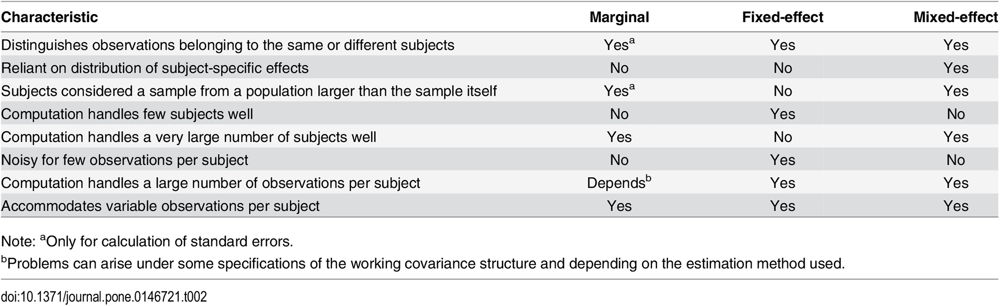

---
title: "Repeated Measures and Longitudinal Data Analysis II"
author: "Levi Waldron"
output: beamer_presentation
---

# Welcome and outline - session 10

* Learning objectives
    - identify hierarchical data
    - define mixed effects models and population average models
    - perform model diagnostics for random effects models
    - interpret random intercepts and random slopes

* Vittinghoff sections 8.2, 8.3, 8.5

# Recall the simple repeated measures example: fecal fat

* Lack of digestive enzymes in the intestine can cause bowel absorption problems.
     - This will be indicated by excess fat in the feces. 
     - Pancreatic enzyme supplements can alleviate the problem.
     - fecfat.csv: a study of fecal fat quantity (g/day) for individuals given each of a placebo and 3 types of pills
     


```{r readdata, echo=FALSE}
fecfat <- read.csv("fecfat.csv")
fecfat$pilltype <- factor(fecfat$pilltype, levels=c("none", "tablet", "capsule", "coated"))
fecfat$subject <- factor(fecfat$subject)
```

# Fecal fat dataset

```{r, echo=FALSE, fig.height=6, warning=FALSE}
fecfat$fecfatminusmean <- residuals(lm(fecfat ~ subject, data=fecfat))
par(mfrow=c(1,2), cex=1.35)
library(RColorBrewer)
# colors from display.brewer.all(n=3)
mycols <- c("white", brewer.pal(n=3, "Pastel2"))
boxplot(fecfat ~ pilltype, data=fecfat,
        notch=TRUE,
        col=mycols, 
        xlab="Treatment", ylab="Fecal Fat (mg/day)")
stripchart(fecfat ~ pilltype, data=fecfat, vertical=TRUE, pch=20,
           method="jitter", jitter=0.1, add=TRUE)
interaction.plot(x.factor=fecfat$pilltype, 
                 trace.factor=fecfat$subject, 
                 response=fecfat$fecfat, 
                 xlab="Treatment", ylab="Fecal Fat (mg/day)",
                 legend=FALSE)
```

# Analysis strategies for hierarchical data

* Analyses for each subgroup
    - e.g., look at each patient independently
    - doesn't work at all in this example, and in general is not an integrated analysis of the whole data
    - could sort of work for an example with many patients per doctor, a few doctors
    
* Analysis at the highest level in the hierarchy
    - first summarize data to highest level
    - doesn't work at all in this example
    - could sort of work for an example with many patients per doctor, a few doctors

* Analysis on "Derived Variables"
    - consider each treatment type separately, take differences in fat levels between treatment/control for each patient and use paired t-tests
    - can work, but not work for unbalanced groups (e.g. incomplete data for some participants)

# Better analysis strategies for hierarchical data

* Fixed effects models
* Random / mixed effects models
    - model certain regression coefficients (intercept, slopes) as random variables
* Population average models
    - using Generalized Estimating Equations (GEE)

# When is hierarchical analysis needed?

* Hierarchical analysis strategies are needed:
     1. when the correlation structure is of primary interest, _e.g._ familial aggregation of disease, or consistency of treatment within centers,
     2. when we wish to “borrow strength” across the levels of a hierarchy in order to improve estimates, and
     3. when dealing with unbalanced, correlated data.

# Fixed effects: two-way analysis of variance

* Two-way ANOVA (person $i$ with pill type $j$):
$$
FECFAT_{ij} = \beta_0 + \beta_{subject i} SUBJECT_i + \beta_{pilltype j} PILLTYPE_j + \epsilon_{ij}
$$
Assumption: $\epsilon_i \stackrel{iid}{\sim} N(0, \sigma_\epsilon^2)$

\footnotesize

```{r, results='asis', echo=FALSE, message=FALSE}
library(xtable)
fit2 <- lm(fecfat ~ subject + pilltype, data=fecfat)
print(xtable(anova(fit2), caption="Two-way analysis of variance table.  Equivalent to subtracting the mean fecal fat content for each individual."), comment=FALSE)
```

\normalsize
* Accounts for individual differences in mean fecal fat
* Fits a coefficient for mean fecal fat per indivudual


# Mixed effects model

* Model looks like two-way ANOVA:
$$
FECFAT_{ij} = \beta_0 + \beta_{subject i} SUBJECT_i + \beta_{pilltype j} PILLTYPE_j + \epsilon_{ij}
$$
     - Assumption: $\epsilon_i \stackrel{iid}{\sim} N(0, \sigma_\epsilon^2)$

* But instead of fitting a $\beta$ to each individual, we assume that the subject effects are selected from a distribution of possible subject effects:
$$
FECFAT_{ij} = \beta_0 + SUBJECT_i + \beta_{pilltype j} PILLTYPE_j + \epsilon_{ij}
$$

Where we assume: $SUBJECT_i \stackrel{iid}{\sim} N(0, \tau_{00}^2)$

* This is a *mixed effects* model because:
    - the "true" intercept varies randomly from patient to patient
    - the "true" (population) coefficient of treatment is fixed (the same for everyone)

# Mixed effects model coeffients, variances, ICC

```{r, echo=FALSE}
##Shortcut for calculating ICC from an lme object:
ICClme <- function(out){
  varests <- as.numeric(VarCorr(out)[1:2])
  varests[1] / sum(varests)
}
```

\tiny
```{r, message=FALSE, echo=FALSE}
library(nlme)
fitmix <- nlme::lme(fecfat ~ pilltype, data=fecfat, random=~1|subject)
fitmix
```

$ICC = 15.9^2 / (15.9^2 + 10.34^2)$ = `r round(15.9^2 / (15.9^2 + 10.34^2), 2)` = `r round(ICClme(fitmix), 2)`.

\normalsize

* Recall ICC is a measure of how large the subject effect is, in relation to the error term
* Variances were estimated directly by the model!

# Assumptions of the mixed model

$$
FECFAT_{ij} = \beta_0 + SUBJECT_i + \beta_{pilltype j} PILLTYPE_j + \epsilon_{ij}
$$

* Normally distributed residuals as in fixed effects model: 
    - $\epsilon_i \stackrel{iid}{\sim} N(0, \sigma_\epsilon^2)$
* Normally distributed **latent variable**:
    - $SUBJECT_i \stackrel{iid}{\sim} N(0, \tau_{00}^2)$

# Mixed effects model results (cont'd)
A plot of the random intercept:
```{r, echo=FALSE}
par(cex=2)
plot(ranef(fitmix), cex=2)
```

# Mixed effects model diagnostics
```{r, echo=FALSE}
par(mfrow=c(1,2), cex=1.5)
qqnorm(residuals(fitmix, type="pearson"), main="QQ plot residuals")
qqline(residuals(fitmix, type="pearson"))
qqnorm(ranef(fitmix)[, 1], main="QQ plot random intercepts")
qqline(ranef(fitmix)[, 1])
```

# Mixed effects model results
\tiny
```{r, echo=FALSE}
summary(fitmix)
```
\normalsize

# Mixed effects model results (cont'd)

* Note on correlation of the estimator of the fixed effects
    + high correlations may (but not necessarily) be due to collinearity
    + not usually useful, not included in output of some packages

# Mixed effects model results (cont'd)
Inference for variance terms (and fixed effects):
\tiny
```{r, echo=FALSE}
intervals(fitmix)
```
\normalsize

* Would conclude that variation of the intercept between subjects is non-zero
    + not attributable to within-subject variation

     
# Longitudinal data
* Interested in the change in the value of a variable within a “subject” 
* Collect data repeatedly through time. 
* For hierarchical longitudinal analysis to be effective, before/after measurements need to be positively correlated

```{r, message=FALSE, echo=FALSE}
library(nlme)
fitmix <- nlme::lme(fecfat ~ pilltype, data=fecfat, random=~1|subject)
```

# Longitudinal data
* Interested in the change in the value of a variable within a “subject” 
* Collect data repeatedly through time. 
* For hierarchical longitudinal analysis to be effective, before/after measurements need to be positively correlated

# Longitudinal data examples

* Example 1: a measure of sleepiness before and after administration of treatment or placebo
* Example 2: Study of Osteoporotic Fractores (SOF dataset)
     - 9,704 women tracked with clinical visits every two years
     - Bone Mineral Density (BMD), Body Mass Index (BMI), many other variables
* Questions for Example 2:
     1. Is change in BMD related to age at menopause?  This is a time-invariant predictor, age at menopause, with time-dependent changes in the outcome, BMD.
     2. Is change in BMD related to change in BMI? This is an analysis relating a time-varying predictor, BMI, with changes in the outcome, BMD. BMI varies quite a lot between women, but also varies within a woman over time.

# Longitudinal data examples (cont'd)

* birthweight and birth order
* provides birthweights and order of infants from mothers who had 5 children in Georgia
     - interested in whether birthweight of babies changes with order
     - whether this difference depends on the _mother's age at first childbirth_ or on the _weight of initial baby_.

```{r, echo=FALSE}
ga <- read.csv("gababies.csv")
ga$momage[ga$momage==99] <- NA
ga$agebin <- cut(ga$initage, breaks=c(0, 20, 100))
##ga <- ga[ga$birthord %in% c(1, 5), ]
ga$momid=factor(ga$momid)
ga$lowbrth=factor(ga$lowbrth, levels=0:1, labels=c("normal", "low"))
```

# Georgia Birthweights dataset
"Spaghetti" plot:
```{r, echo=FALSE}
interaction.plot(x.factor=ga$birthord, 
                 trace.factor=ga$momid, 
                 response=ga$bweight, 
                 xlab="Birth Order", ylab="Birth Weight (g)",
                 legend=FALSE)
```

# Georgia Birthweights dataset
* Do birth weights or the effect of birth order vary by mother?
     + random intercept, random slope

```{r}
gafit1 <- nlme::lme(bweight ~ birthord, data=ga, 
    random=~birthord|momid,
    na.action=na.omit,
    control=list(msMaxIter=600, msMaxEval=600, 
                 sing.tol=1e-20, msVerbose=FALSE))  
```

Note: the control argument increases the max # iterations to allow convergence. If `msVerbose=TRUE`, it produces verbose output.

# Georgia Birthweights dataset (cont'd)
```{r, echo=FALSE}
plot(ranef(gafit1))
```

# Georgia Birthweights dataset (cont'd)
\tiny
```{r}
summary(gafit1)
```

# Georgia Birthweights dataset (cont'd)

\tiny
```{r}
intervals(gafit1)
```
\normalsize

* Do birth weights or the effect of birth order vary by mother?
    - yes: both standard deviations are non-zero

# Population Average Models

* An alternative to random / mixed-effects models that is more robust to assumptions of:
    - distribution of random effects
    - correlation structure

* Estimates correlation structure from the data rather than assuming normality    
    - Requires a fair bit more clusters than observations per cluster

* Estimates regression coefficients and robust standard errors
    - commonly by Generalized Estimating Equations (GEE)

# Population Average Models

* Compare mixed model multiple linear regression:
$$
E[Y_{ij}|X_{ij}] = \beta_0 + \alpha_{0j} + \beta_1 X_{ij}, \alpha_{0j} \sim N(0, \sigma)
$$
for subject $i$ in group $j$.

* to a population average model:
$$
E[Y_{ij}|X_{ij}] = \beta_0^* + \beta_1^* X_{ij}
$$

* Interpretations of $\beta^*$ and $\beta$ are equivalent
* Numerically equivalent for linear and log-linear models (if specification of mixed model is correct), but not for logistic link.


# Fit a population average model

\tiny
```{r, message=FALSE, results="hide"}
gafit.gee <- gee::gee(bweight ~ birthord, corstr="exchangeable",
                      id=momid, data=ga)
```
```{r}
summary(gafit.gee)
```


# GEE working correlation types

* Must make some assumption about form of correlation among observations from the same subject, same hospital, etc

* Independence
    - no correlation between measurements within group
* Exchangeable
    - all correlations (except those variables with themselves) are a common value
    - nothing to distinguish one member of a cluster from another
    - appropriate in the absence of other data structures such as measurements taken through time or space
* Auto-regressive
    - observations taken more closely in time are more highly correlated

# GEE working correlation types

* Unstructured
    - estimates a separate correlation between observations taken on each pair of "times"
* Non-stationary
    - similar to unstructured, but assumes all correlations for pairs separated far enough in time are zero
* Stationary
    - e.g. stationary of order 2: observations taken at time points 1 and 3 have the same correlation as time points 2 and 4
    - but this might be different from the correlation between observations taken at times 2 and 3
    - correlations for observations 3 or more time periods apart assumed to be zero

*Fewer assumptions requires more data, and good assumptions improve results*

# Help in choosing a method



# Conclusions

* Ignoring within-subject correlations can produce very wrong results, and is not always "conservative"
* Hierarchical analysis strategies are needed for any of:
     1. When the correlation structure is of primary interest, _e.g._ familial aggregation of disease, or consistency of treatment within centers,
     2. When we wish to “borrow strength” across the levels of a hierarchy in order to improve estimates, and
     3. When dealing with unbalanced correlated data.  E.g., no requirement that each Georgia mother have exactly 5 children.
* Population average models provide a robust alternative to mixed models
    - for one level of hierarchy
    
# Lab exercise

For the fecal fat dataset:
1. Fit a linear model with random coefficients for pills, and summarize the output
2. Estimate confidence intervals for the coefficients of this model, and interpret them
3. Calculate the ICC
4. Create residuals plots for this model and interpret
5. Fit population average models for the fecal fat dataset using at least two different working correlation structures. Compare the results to each other and to the mixed model
