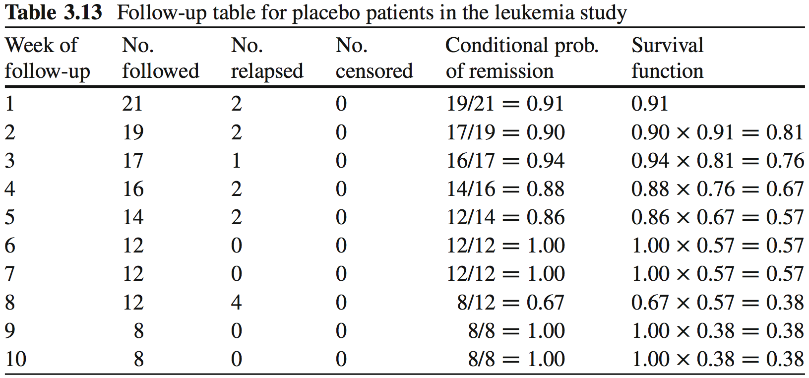

---
title: "Survival Analysis I"
author: "Levi Waldron"
output: beamer_presentation
---

# Welcome and outline - session 6

* Vittinghoff sections 3.1-3.5
* What is survival analysis?
    + Outcome variable: time-to-event
    + Censored data
* Assumptions in survival analysis
* Survival function and Kaplan-Meier estimator
* Comparing groups - Log-rank test

# Learning objectives

* Distinguish censored data from binary or continuous data
* Define survival function, hazard functions, cumulative event function
* Perform a Kaplan-Meier estimate
* Perform, interpret, and identify assumptions of the logrank test
* Define **potential follow-up time**
* Calculate median survival time and potential follow-up time

# Outcome variable: time to event

* Generally time to the occurrence of a particular event, e.g. 
    + death
    + disease recurrence
    + or other experience of interest

* Time: The time from the beginning of an observation period t0 (e.g. surgery) to:
    + an event, or 
    + end of the study, or
    + loss of contact or withdrawal from the study

# Typical research questions

* What is the median survival time (in years) of patients diagnosed with a certain disease?
* What is the probability of those patients surviving for at least 5 years?
* Are certain personal, behavioral, or clinical characteristics correlated with participant’s chance of survival?
* Is there a survival difference between groups?
    + e.g. treatment vs. control
    + e.g. exposed vs. unexposed

# Special considerations in survival analysis

* Survival data requires special techniques:
    + Survival data is generally not normally distributed
    + **Censoring** - observe individuals for differing lengths of time that may or may not result in an "event"
* Censoring is a key challenge in survival analysis.  Consider a clinical study where:
    + patient 1 dies 1 month after diagnosis
    + patient 2 dies 12 years after diagnosis
    + patient 3 is lost to follow-up after 1 month
    + patient 4 is still alive after 12 years of follow-up

*Question #1: which patients are "censored?"*

*Question #2: how would you rank these patients in order of disease severity?*

# Definitions

*Definition*: A survival time is said to be *right-censored* 
at time t if it is only known to be greater than t.

*Definition*: The *survival function* at time t, denoted $S(t)$, is the probability of being event-free at t.  Equivalently, it is the probability that the survival time is greater than t.

# leukemia Example: see leuk.csv
* Study of 6-mercaptopurine (6-MP) maintenance therapy for children in remission from acute lymphoblastic leukemia (ALL)
* 42 patients achieved remission from induction therapy and were then randomized in equal numbers to 6-MP or placebo.
* Survival time studied was from randomization until relapse.

Survival times in weeks for Placebo group:
```{r, echo=FALSE, message=FALSE}
leuk <- read.csv("leuk.csv")
library(survival)
with(leuk[leuk$group=="Placebo", ], Surv(time, cens))
```

Survival times in weeks for Treatment group:
```{r, echo=FALSE}
with(leuk[leuk$group=="6 MP", ], Surv(time, cens))
```


# A graphical look at the treatment group

```{r, echo=FALSE}
par(cex=2)
leuk.t <- leuk[leuk$group=="6 MP", ]
set.seed(1)
t0 <- sample(0:26, size=nrow(leuk.t), replace=TRUE)
t1 <- t0 + leuk.t$time
plot(x=seq(min(t0), max(t1), length.out=nrow(leuk.t)+2), y=0:(nrow(leuk.t)+1), 
     type='n', yaxt='n', xlab="Time (weeks)", ylab="Treatment Group Patients")
segments(x0=t0, x1=t1, y0=1:nrow(leuk.t), y1=1:nrow(leuk.t))
points(x=t0, y=1:nrow(leuk.t), pch="|", cex=0.75)
points(x=t1[leuk.t$cens==0], y=which(leuk.t$cens==0), pch=">", cex=0.5)
points(x=t1[leuk.t$cens==1], y=which(leuk.t$cens==1), pch="X", cex=0.5)
```

(Initiation times (t0) are simulated between 0 and 26 weeks)

# leukemia study follow-up table



This is the **Kaplan-Meier Estimate** $\hat S(t)$ of the Survival function $S(t)$.

# Kaplan-Meier Estimate vs. time

```{r, echo=FALSE}
suppressPackageStartupMessages(library(survminer))
par(cex=1.5)
fit <- survfit(Surv(time, cens)~group, data=leuk)
ggsurvplot(fit, xlab="Time (weeks)", ylab="Survival Probability", risk.table=TRUE)
```

# Median Survival Time

*Definition*: *Median Survival Time* is the time at which half of a group (sample, population) is expected to experience an event (in this example, death)

* Without censoring, median survival time can be calculated the obvious way
* With censoring, we need to use the Kaplan-Meier estimate of the survival function $\hat S(t)$

\footnotesize
```{r}
survfit(Surv(time, cens)~group, data=leuk)
```

# Median Potential Follow-Up Time

*Definition*: *Median Potential Follow-Up Time* is the time for which half of a sample would have been expected to be followe, *in the absence of events*.

* Without any events, median follow-up time can be calculated the obvious way
* With events, a simple median will *under-estimate* the potential follow-up time.  Use a reverse Kaplan-Meier estimate instead:
 
\footnotesize
```{r}
survfit(Surv(time, 1-cens)~group, data=leuk)
```

*Note*: *Actual* median follow-up time is half as long for the placebo group, but there is not reason to believe the potential follow-up times were different

# Cumulative Event Function

*Definition*: The *cumulative event function* at time t, denoted $F(t)$, is the probability that the event has occurred by time t, or equivalently, the probability that the survival time is less than or equal to t. Note $F(t) = 1-S(t)$.

```{r, echo=FALSE, fig.height=6}
par(mfrow=c(1,2), cex=1.5)
fit <- survfit(Surv(time, cens)~group, data=leuk)
plot(fit, lty=1:2, lw=2,
     xlab="Time (weeks)", ylab="Survival Probability S(t)")
legend("topright", lty=1:2, legend=c("6 MP", "Placebo"), bty="n")
plot(fit, fun="event", lty=1:2, lw=2, 
     xlab="Time (weeks)", ylab="Event Probability F(t)")
```

# Hazard and Cumulative Hazard functions
* $h(t)$: hazard function, risk of event at a point in time
    + only calculated by software
* $H(t) = -log[S(t)]$: cumulative hazard function
    + not easily interpretable
    + cumulative force of mortality, or the number of events that would be expected for each individual by time t if the event were a repeatable process.
* Will be important next class for Cox Proportional Hazards

# Comparing Groups Using the Logrank Test

* *logrank test* is used to compare survival between two or more groups
    + $H_0$ is that the population survival functions are equal at all follow-up times
    + $H_1$ is that the population survival functions differ at at least one follow-up time
* logrank test is really just a *chi-square test* comparing expected vs. observed number of events in each group.  
    + Observed is just what we see.
    + How to calculate expected?
    
# Comparing Groups Using the Logrank Test

\footnotesize
```{r}
survdiff(Surv(time, cens)~group, data=leuk)
```

* Many alternatives are available, but log-rank should be the default unless you have good reason.
    + E.g. Wilcoxon (Breslow), Tarone-Ware, Peto tests


# Notes about the Logrank Test

* Non-parametric: no assumptions on the form of $S(t)$
* Log-rank test and K-M curves don’t work with continuous predictors
* Assumes *non-informative censoring*:
    + censoring is unrelated to the likelihood of developing the event of interest
    + for each subject, his/her censoring time is statistically independent from their failure time
    
# Summary

* Censoring requires special methods to make full use of the data
* Kaplan-Meier estimate provides non-parametric estimate of the survival function
    + non-parametric meaning that no form of the survival function is assumed; instead it is empirically estimated
* Logrank test provides a non-parametric hypothesis test
    + H0: identical survival functions of multiple strata

# Lab exercises

1. Calculate the follow-up table for 6 MP patients in the leukemia study
2. Plot the Kaplan-Meier estimate of the follow-up table from 1. `library(survminer)` is recommendable. 
3. What is the 75th percentile of survival times for the 6 MP group? For the Placebo group? This is the time that 75% of the patients survive.
4. Suppose you were instructed to cap follow-up times at 20 weeks. Re-do the Kaplan-Meier plot for both groups, and re-do the logrank test.
5. Give a hypothetical example of how censoring in this example might be "informative."
 