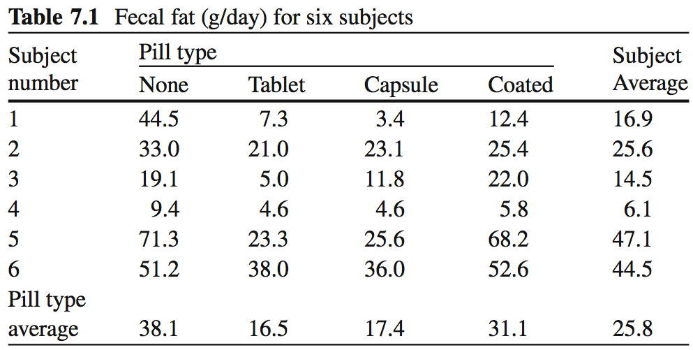
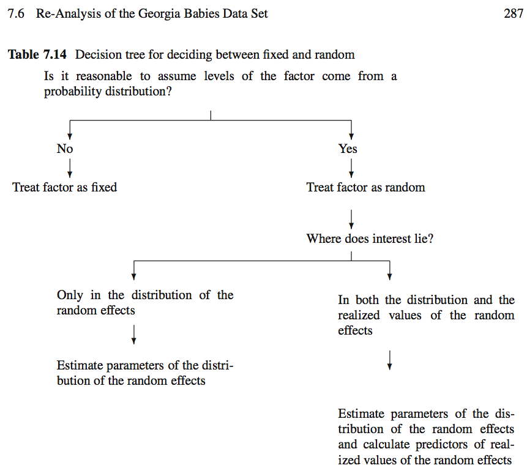

---
title: "Repeated Measures and Longitudinal Data Analysis I"
author: "Levi Waldron"
output: beamer_presentation
---

# Welcome and outline - session 9

Learning objectives:

* Identify and define hierarchical and longitudinal data
* Analyze correlated data using Analysis of Variance
* Identify and define random and fixed effects

Textbook sections:

* Vittinghoff sections 7.1 (7.2-7.3 next class)

# What are hierarchical and longitudinal data?

* Knee radiographs are taken yearly in order to understand the onset of osteoarthritis
* An indicator of heart damage is measured at 1, 3, and 6 days following a brain hemorrhage.
* Groups of patients in a urinary incontinence trial are assembled from different treatment centers
* Susceptibility to tuberculosis is measured in family members
* A study of the choice of type of surgery to treat a brain aneurysm either by clipping the base of the aneurysm or implanting a small coil. The study is conducted by measuring the type of surgery a patient receives from a number of surgeons at a number of different institutions.

# What is the distinction between hierarchical and longitudinal data?

* Longitudinal data are repeated measures over time
* Longitudinal data are a type of hierarchical data
    - repeated measures are correlated, and nested within the observational unit (individual)
* Other non-longitudinal data can also be hierarchical

_Definition_: Hierarchical data are data (responses or predictors) collected from or specific to different levels within a study.

# Important features of this type of data

1. The outcomes are correlated across observations
2. The predictor variables can be associated with different levels of a hierarchy.  _e.g._ we might be interested in:
     - the volume of operations at the hospital, 
     - whether it is a for-profit or not-for-profit hospital,
     - years of experience of the surgeon or where surgeons were trained, 
     - how the choice of surgery type depends on the age and gender of the patient.

# A Simple Repeated Measures Example: Fecal Fat

* Lack of digestive enzymes in the intestine can cause bowel absorption problems.
     - This will be indicated by excess fat in the feces. 
     - Pancreatic enzyme supplements can alleviate the problem.
     - fecfat.csv: a study of fecal fat quantity (g/day) for individuals given each of a placebo and 3 types of pills
     


# Option 1: non-hierarchical analysis (wrong)
```{r readdata, echo=FALSE}
fecfat <- read.csv("fecfat.csv")
fecfat$pilltype <- factor(fecfat$pilltype, levels=c("none", "tablet", "capsule", "coated"))
fecfat$subject <- factor(fecfat$subject)
```

```{r simpleboxplot, echo=FALSE, warning=FALSE}
par(cex=1.5)
library(RColorBrewer)
# colors from display.brewer.all(n=3)
mycols <- c("white", brewer.pal(n=3, "Pastel2"))
boxplot(fecfat ~ pilltype, data=fecfat,
        notch=TRUE,
        col=mycols, 
        xlab="Treatment", ylab="Fecal Fat (mg/day)")
stripchart(fecfat ~ pilltype, data=fecfat, vertical=TRUE, pch=20,
           method="jitter", jitter=0.1, add=TRUE)
```

# Option 1: non-hierarchical analysis (wrong)

\footnotesize
```{r}
fit1way <- lm(fecfat ~ pilltype, data=fecfat)
```

```{r, results='asis', echo=FALSE, message=FALSE}
library(xtable)
print(xtable(anova(fit1way), caption="One-way analysis of variance table for fecal fat dataset"), comment=FALSE)
##library(stargazer)
##stargazer(anova(fit1way), title="One-way analysis of variance results", style="all2", header=FALSE)
```

* Does not account for similarity of measurements within individual
* Would be correct if each treatment were given to a different individual

# Option 2: two-way analysis of variance (getting closer)

* Accounts for individual differences in mean fecal fat
* Fits a coefficient for mean fecal fat per indivudual

```{r, echo=FALSE, fig.height=6}
fecfat$fecfatminusmean <- residuals(lm(fecfat ~ subject, data=fecfat))
par(mfrow=c(1,2), cex=1.35)
interaction.plot(x.factor=fecfat$pilltype, 
                 trace.factor=fecfat$subject, 
                 response=fecfat$fecfat, 
                 xlab="Treatment", ylab="Fecal Fat (mg/day)",
                 main="No subject effect correction", legend=FALSE)
interaction.plot(x.factor=fecfat$pilltype, 
                 trace.factor=fecfat$subject, 
                 response=fecfat$fecfatminusmean, 
                 xlab="Treatment", ylab="Fecal Fat (mg/day)",
                 main="Subject mean subtracted", legend=FALSE)
```

# Option 2: 2-way analysis of variance (getting closer)
\footnotesize

```{r}
fit1way <- lm(fecfat ~ pilltype, data=fecfat)
```
```{r, results='asis', echo=FALSE, message=FALSE}
print(xtable::xtable(anova(fit1way), caption="One-way analysis of variance table for fecal fat dataset"), comment=FALSE)
```

```{r}
fit2way <- lm(fecfat ~ subject + pilltype, data=fecfat)
```
```{r, results='asis', echo=FALSE, message=FALSE}
print(xtable(anova(fit2way), label="2", caption="Two-way analysis of variance table. Note the similarity of the pilltype row."), comment=FALSE)
```

# What happened??

* 1-way ANOVA correctly estimates the effect of pill type
* However, 1-way ANOVA fails to accommodate the correlation within subjects
* 1-way ANOVA over-estimates the residual variance
     - under-estimates the significance of pill type

# Regression models for 1 and 2-way ANOVA

* Recall for ordinary multiple linear regression:
\begin{equation*}
E[y|x] = \beta_0 + \beta_1 x_1 + \beta_2 x_2 + ... + \beta_p x_p
\end{equation*}
     - $x_p$ are the predictors or independent variables
     - $y$ is the outcome, response, or dependent variable
     - $E[y|x]$ is the expected value of $y$ given $x$
     - $\beta_p$ are the regression coefficients

# Regression models for 1 and 2-way ANOVA

* One-way ANOVA (person $i$ with pill type $j$):
\begin{equation*}
\begin{aligned}
FECFAT_{ij} &= \textrm{fecal fat measurement for person i with pill type j} \\
            &= \mu + PILLTYPE_j + \epsilon_{ij}
\end{aligned}
\end{equation*}

* Two-way ANOVA:
\begin{equation*}
FECFAT_{ij} = \mu + SUBJECT_i + PILLTYPE_j + \epsilon_{ij}
\phantom{\hspace{3cm}}
\end{equation*}

Assumption: $\epsilon_{ij} \stackrel{iid}{\sim} N(0, \sigma_\epsilon^2)$

# Correlations within subjects

* One-way ANOVA fails because it does not account for the correlation of measurements within-person
* How highly correlated are measurements on the same person? Consider subject $i$, pill types $j$ and $k$:

\begin{equation*}
corr(FECFAT_{ij}, FECFAT_{ik}) = 
          \frac{cov(FECFAT_{ij}, FECFAT_{ik})}
               {sd(FECFAT_{ij}) sd(FECFAT_{ik})}
\end{equation*}
* This is a measure of how large the subject effect is, in relation to the error term

# Correlation within subjects

\begin{equation*}
\begin{aligned}
cov(FECFAT_{ij}, FECFAT_{ik}) &= cov(SUBJECT_i, SUBJECT_i) \\
                              &= var(SUBJECT_i) \\
                              &= \sigma_{subject}^2. \textrm{(definition)}
\end{aligned}
\end{equation*}

* Equality 1:
    + $\mu$ and $pilltype$ terms are assumed to be constant, so do not enter into covariance calculation
    + residuals $\epsilon$ are assumed to be independent
* Equality 2: 
    + covariance with self is variance

Recall $SUBJECT_i$ is the term for individual in 2-way AOV. Now $\beta_i * subjectID$, will later be treated as a **random variable**

# Correlation within subjects
Previous slide calculated *covariance*. Also need *variance*.

\begin{equation*}
\begin{aligned}
var(FECFAT_{ij}) &= var(SUBJECT_i, SUBJECT_i) + var(\epsilon_{ij}) \\
                              &= \sigma_{subject}^2 + \sigma_{\epsilon}^2. \textrm{(definition)}
\end{aligned}
\end{equation*}

* Difference is that the independent residuals do contribute to $var(FECFAT_{ij})$
* Variance is broken into componenets due to *subject* and *residual* variance

# Intraclass Correlation

The correlation between two treatments $j$ and $k$ across subjects $i$ is:
\begin{equation*}
\begin{aligned}
corr(FECFAT_{ij}, FECFAT_{ik}) & = 
          \frac{cov(FECFAT_{ij}, FECFAT_{ik})}
               {sd(FECFAT_{ij}) sd(FECFAT_{ik})} \\
      & = \frac{\sigma_{subj}^2}{\sigma_{subj}^2 + \sigma_{\epsilon}^2} \\
ICC & = \frac{\tau_{00}^2}{\tau_{00}^2 + \sigma_\epsilon^2}
\end{aligned}
\end{equation*}

# Intuition behind correlations within subjects


\footnotesize
```{r, echo=FALSE, message=FALSE, results='hide'}
library(tidyr)
library(dplyr)
fecfat.wide <- fecfat %>% 
  select(-fecfatminusmean) %>%  #get rid of fecfatminusmean column
  spread(key=pilltype, value=fecfat) %>%
  mutate(MEAN = (none+tablet+capsule+coated)/4)
#print(xtable::xtable(fecfat.wide, digits=1, 
#                     caption="Wide version of fecal fat dataset"), 
#      comment=FALSE)
```

Variance of the subject averages (`r round(var(fecfat.wide$MEAN), 1)`) is increased by correlation of measurements within individual.

# Calculation of correlations within subjects (ICC)

What is your estimate of the variability due to subjects, from the 2-way ANOVA?
\footnotesize
```{r}
sum(residuals(fit2way)^2) / 15 / 4 #df=15, divided by 4 pilltypes
279.419 - 26.75 #var(SUBJECT_i)
```
Residual variance is:
```{r}
sum(residuals(fit2way)^2) / 15 #df=15
```
# Calculation of correlations within subjects (ICC)

Finally calculate ICC:

\begin{equation*}
\begin{aligned}
ICC &= \frac{\sigma_{subj}^2}{\sigma_{subj}^2 + \sigma_{\epsilon}^2} \\
    &= \frac{253}{253 + 107}
    &= 0.70
\end{aligned}
\end{equation*}

This calculation will become easier when we learn to estimate *random coefficients* in directly in the regression model.

# The next step: a mixed effects model

* Two-way ANOVA is a fixed effects model:
$$
FECFAT_{ij} = \beta_0 + \beta_{subject i} SUBJECT_i + \beta_{pilltype j} PILLTYPE_j + \epsilon_{ij}
$$
     - Assumption: $\epsilon_i \stackrel{iid}{\sim} N(0, \sigma_\epsilon^2)$

* Instead of fitting a $\beta_{subject i}$ to each individual, assume that subject effects are selected from a distribution of possible subject effects:
$$
FECFAT_{ij} = \mu + SUBJECT_i + \beta_{pilltype j} PILLTYPE_j + \epsilon_{ij}
$$
where $SUBJECT_i \stackrel{iid}{\sim} N(0, \sigma_{subj}^2)$

* Here subject is a _random_ effect, and pill type is a _fixed_ effect.
* This is also a random intercept model

# Random and fixed effects


# Summary: correlations within subjects
* Subject-to-subject variability simultaneously raises or lowers all the observations on a subject
     - induces correlation of within-subject measurements
* Variability of individual measurements can be separated into that due to subjects and that left to residual variance.
     - $var(FECFAT_{ij}) = \sigma_{subj}^2 + \sigma_{\epsilon}^2$
* 2-way ANOVA does not directly estimate variability due to subjects
     - variance of coefficients for individual is not too far off

# Summary: hierarchical data
* Estimates of coeffients (or "effect sizes") are unchanged by hierarchical modeling
* Ignoring within-subject correlations results in incorrect estimates of variance, F statistics, p-values
     - not always "conservative"
* Intraclass Correlation (ICC) provides a measure of correlation induced by grouping
* Should be able to recognize fixed and random effects

# Lab

1. Load the fecal fat dataset
2. Produce summary statistics for the dataset
3. Create a boxplot for fecal fat vs. treatment type
4. Create a spaghetti plots for fecal fat vs. treatment type, with and without subject means subtracted
5. Fit a linear model with random coefficients for pills, and summarize the output
6. Create residuals plots for this model and interpret
7. Calculate the ICC